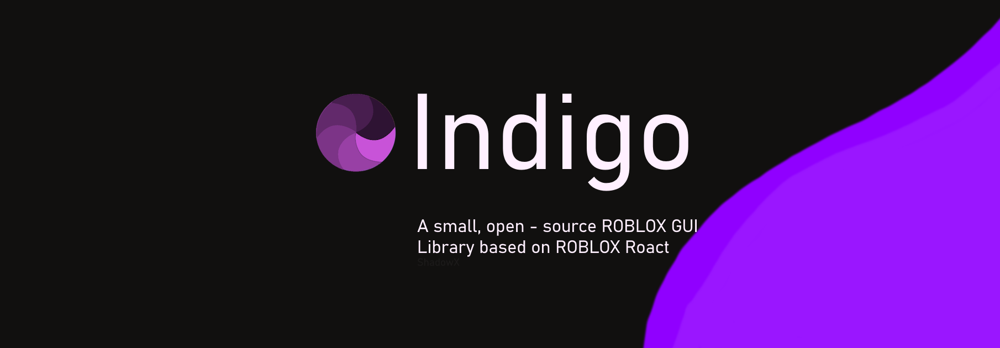

# Home

<figure><figcaption></figcaption></figure>

Indigo is a light-weight, _simple GUI Library_ made for _ROBLOX_, inspired by [Roact](https://roblox.github.io/roact/). The documentation here is centred around **Indigo**, and not Roact. Although small, Indigo is capable of many things.

**The documentation for Indigo requires you to have some knowledge with lua. I reccomend you learn the basics of lua first before using Indigo.**
